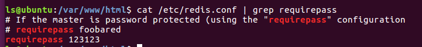
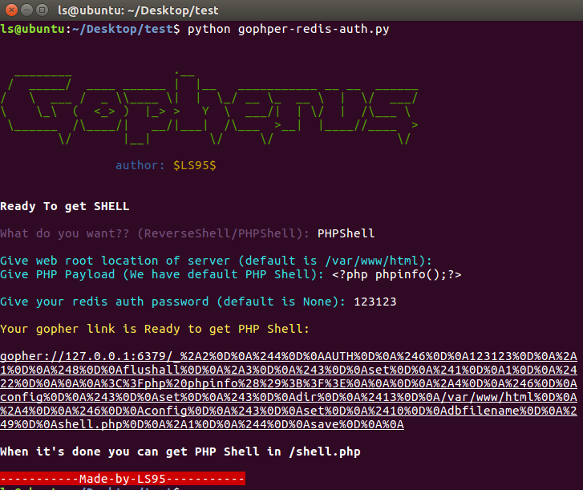
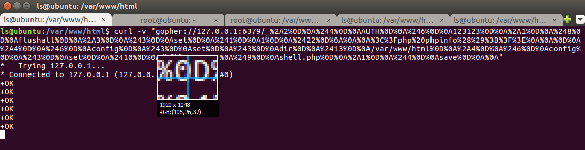
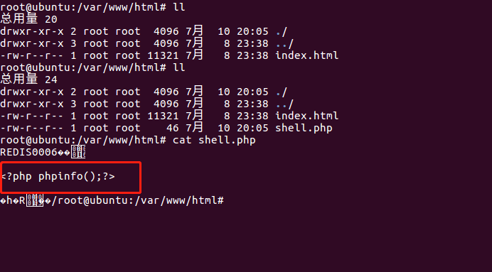

# gopher-redis-auth
This tool generates gopher link for exploiting SSRF and gaining RCE in redis with password.

redis生成gopher利用代码的脚本，包括认证和非认证功能，
主要是在原始代码Gopherus里redis模块的基础上增加authPrePayload用于认证。

## 示例

redis.conf 设置密码为123123  

生成shell  

curl -v  "contens"  

查看shell  

## 参考
[Gopherus](https://github.com/tarunkant/Gopherus)  

[浅析SSRF认证攻击Redis](https://www.anquanke.com/post/id/181599)

